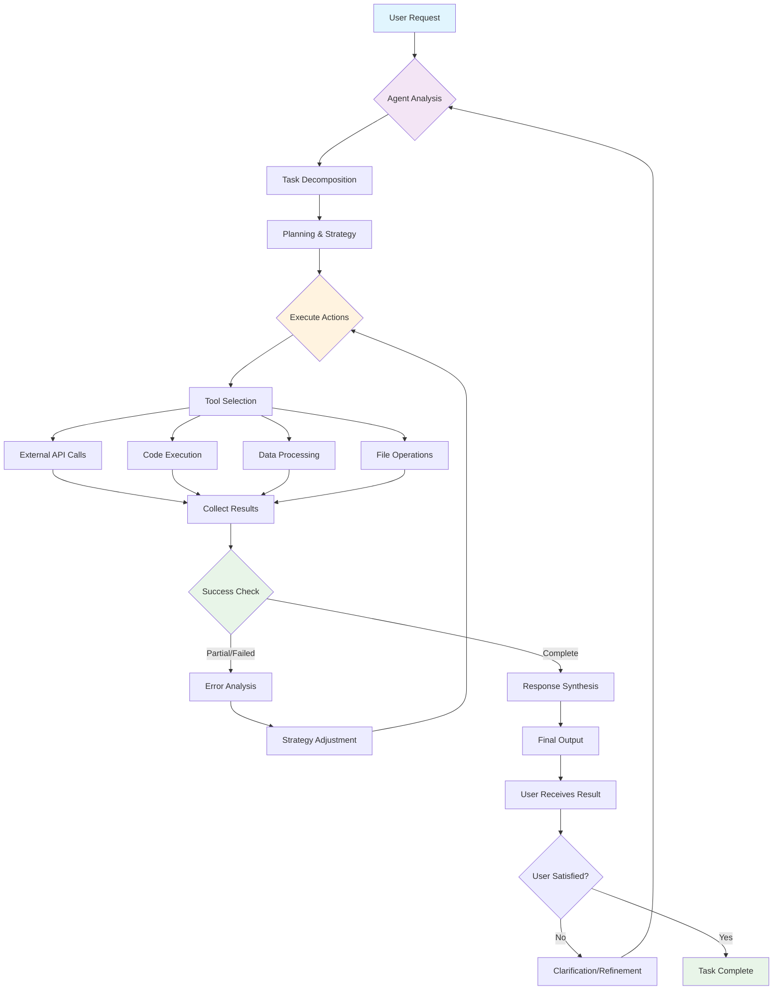
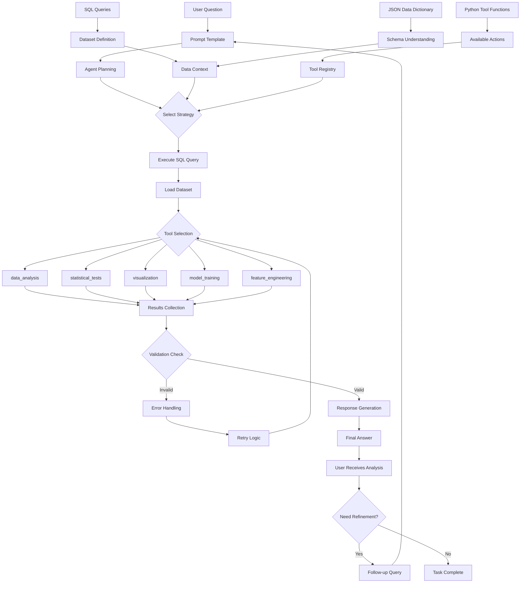

# mermaid

agent work?  

```mermaid
graph TD
    A[User Request] --> B{Agent Analysis}
    B --> C[Task Decomposition]
    C --> D[Planning & Strategy]
    
    D --> E{Execute Actions}
    E --> F[Tool Selection]
    F --> G[External API Calls]
    F --> H[Code Execution]
    F --> I[Data Processing]
    F --> J[File Operations]
    
    G --> K[Collect Results]
    H --> K
    I --> K
    J --> K
    
    K --> L{Success Check}
    L -->|Partial/Failed| M[Error Analysis]
    L -->|Complete| N[Response Synthesis]
    
    M --> O[Strategy Adjustment]
    O --> E
    
    N --> P[Final Output]
    P --> Q[User Receives Result]
    
    Q --> R{User Satisfied?}
    R -->|No| S[Clarification/Refinement]
    R -->|Yes| T[Task Complete]
    
    S --> B
    
    style A fill:#e1f5fe
    style B fill:#f3e5f5
    style E fill:#fff3e0
    style L fill:#e8f5e8
    style T fill:#e8f5e8
```

this is an analytics approach?

```mermaid
graph TD
    A[User Question] --> B[Prompt Template]
    B --> C[Agent Planning]
    
    D[SQL Queries] --> E[Dataset Definition]
    F[JSON Data Dictionary] --> G[Schema Understanding]
    H[Python Tool Functions] --> I[Available Actions]
    
    E --> J[Data Context]
    G --> J
    I --> K[Tool Registry]
    
    C --> L{Select Strategy}
    J --> L
    K --> L
    
    L --> M[Execute SQL Query]
    M --> N[Load Dataset]
    
    N --> O{Tool Selection}
    O --> P[data_analysis]
    O --> Q[statistical_tests]
    O --> R[visualization]
    O --> S[model_training]
    O --> T[feature_engineering]
    
    P --> U[Results Collection]
    Q --> U
    R --> U
    S --> U
    T --> U
    
    U --> V{Validation Check}
    V -->|Invalid| W[Error Handling]
    V -->|Valid| X[Response Generation]
    
    W --> Y[Retry Logic]
    Y --> O
    
    X --> Z[Final Answer]
    Z --> AA[User Receives Analysis]
    
    AA --> BB{Need Refinement?}
    BB -->|Yes| CC[Follow-up Query]
    BB -->|No| DD[Task Complete]
    
    CC --> B
```
