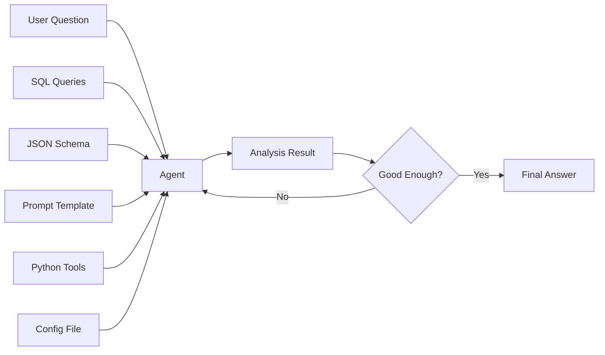

# mermaid

agent work?  

```mermaid
graph LR
    A[User Question] --> B[Agent]
    
    C[SQL Queries] --> B
    D[JSON Schema] --> B
    E[Prompt Template] --> B
    F[Python Tools] --> B
    G[Config File] --> B
    
    B --> H[Analysis Result]
    H --> I{Good Enough?}
    I -->|No| B
    I -->|Yes| J[Final Answer]
```
